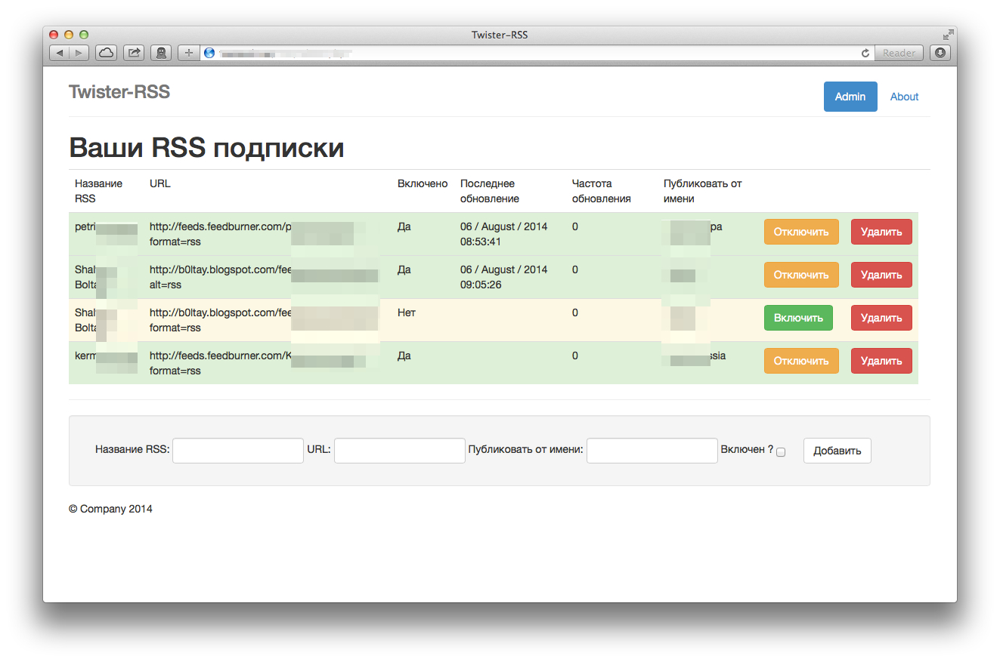

twister-rss
===========

PHP scripts for tranfering RSS feeds to twister

Support English/Russian language.

INSTALL
===========

1) You need your own server, installed twisterd daemon, http server, MYSQL, crontab

2) Go to htdocs main directory

3) git clone https://github.com/iShift/twister-rss.git

4) make new database in MYSQL import twistercms.sql

5) Edit files: settings.php (in $domain add full URL to directory with script - example: you have local server on 127.0.0.1 and htdocs directory on /var/www, after git pull you have /var/www/twister-rss/cms/ and 127.0.0.1/twister-rss/cms you need to add 127.0.0.1/twister-rss in $domain without cms and http)

6) login to your server consol and type crontab -e then add new line 
"*/5 * * * * wget -q -o /dev/null FULL_URL_to_YOUR_site_/update.php"
example: */5 * * * * wget -q -o http://127.0.0.1/twister-rss/cms/update.php

7) Open http://127.0.0.1/twister-rss/cms/ in browser, login with RPC login/password

8) Добавьте новую RSS ленту, обратите внимание аккаунт указанный в поле "Публиковать от имени" должен быть зарегистрирован на сервере с которого будет идти публикация. 

9) Profit
